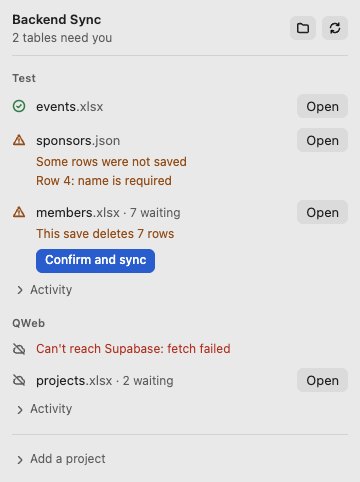

# SupaBaseFolder

Your Supabase tables as plain files on your Mac.

SupaBaseFolder is a macOS menu bar app that turns each table in a Supabase project into a file in
`~/Backend/<project>/`, as either `.xlsx` or `.json`. Edit the file in Excel or VS Code, or let an AI
agent edit it, save, and the change reaches Supabase within seconds. When your site writes to Supabase,
the file updates live.



## What it does

- **Two-way live sync.** File saves push up, and Supabase changes come down through Realtime (or a
  30-second poll for tables that aren't in the Realtime publication).
- **Safe by default.** A save that deletes more than 5 rows, or removes a column, pauses until you
  confirm it in the menu. Every row that gets overwritten or deleted is logged and can be restored from
  the Activity list.
- **Plays nicely with Excel.** It waits while a workbook is open, so it never writes over your unsaved
  edits.
- **Offline-friendly.** Edits made offline queue up and sync on reconnect.
- **Agent-friendly.** Each project folder has a generated `_schema.md` describing every table,
  column and rule, so an AI agent can read it and edit the files correctly.
- **Keys stay in the Keychain.** Project keys are encrypted with macOS `safeStorage` and never written
  into `~/Backend`.

## Run it

```sh
npm install
npm start          # menu bar icon appears; click it, then "Add a project"
npm test
npm run package    # builds dist/SupaBaseFolder.app
```

To add a project, you need its URL and a **secret** key (`sb_secret_…`), found in Supabase under
Project Settings → API Keys. The publishable key can't read the schema.

## Status

v1 works on macOS and is used against real projects. Up next is v2
([design](docs/superpowers/specs/2026-09-23-control-supabase-design.md)): creating tables from files, a
SQL inbox for agents, auth users, storage buckets, and new projects. Additive changes run straight away;
destructive ones wait for a human to approve them.

Built with Electron, supabase-js and SheetJS.
