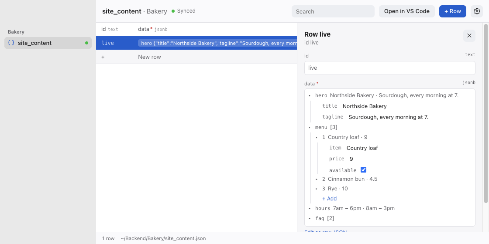

<p align="center">
  
</p>

<h1 align="center">SupaBaseFolder</h1>

<p align="center">
  <b>Your Supabase tables as plain files on your Mac.</b><br>
  Edit a spreadsheet or a JSON file, save it, and it's live.
</p>

<p align="center">
  <a href="https://github.com/zacfink/SupaBaseFolder/releases/latest/download/SupaBaseFolder.zip"></a>
</p>

<p align="center">
  <a href="https://github.com/zacfink/SupaBaseFolder/releases/latest"></a>
  <a href="https://github.com/zacfink/SupaBaseFolder/actions/workflows/tests.yml"></a>
  
</p>

<p align="center">
  
  &nbsp;
  
</p>

---

Every table in a Supabase project becomes a file in `~/Backend/<project>/`, as `.xlsx` or `.json`. Open it in
Excel, VS Code, the built-in table window, or hand it to an AI agent. Save, and the change reaches Supabase in
about a second. When your app writes to Supabase, the file updates on its own.


```mermaid
flowchart LR
  you["Excel · VS Code · AI agent<br/>or the table window"] -- edit --> file["~/Backend/your-project/<br/>table.xlsx or table.json"]
  file -- "save: pushed in ~1s" --> db[("Supabase")]
  db -- "change: file rewritten live" --> file
```

## Get started

1. **[Download](https://github.com/zacfink/SupaBaseFolder/releases/latest/download/SupaBaseFolder.zip)**, unzip
   and drag SupaBaseFolder to Applications. The app isn't signed by Apple, so the first time, right-click it ›
   **Open** › **Open**.
2. **Add a project.** Click the menu bar icon › **Add a project**, then paste the project URL and a secret key
   (`sb_secret_…`) from Supabase › Project Settings › API Keys.
3. **Edit.** Open `~/Backend/<project>/`. Each table is a file. Change it, save, and it's in Supabase.

## What you get

| | | |
|---|---|---|
| **Two-way live sync**<br>Saves push up; Supabase changes come down through Realtime, or within 30 seconds for tables outside the Realtime publication. | **Safe by default**<br>A save that would delete more than 5 rows, or drop a column, waits for you to confirm. Every overwritten or deleted row is logged and one click restores it. | **Plays nicely with Excel**<br>While a workbook is open, it waits, so it never writes over unsaved edits. |
| **JSON without the braces**<br>JSON columns open as a tree you edit in place. See [below](#json-without-the-braces). | **Agent-ready**<br>Each project folder gets a generated `_schema.md` describing every table, column and rule, so an AI agent can edit the files correctly. | **Keys stay private**<br>Project keys are encrypted with macOS `safeStorage` and never written into `~/Backend`. |

## JSON without the braces



Big JSON columns, like a site that keeps all its copy in one row, open as a tree instead of a wall of text.

- Each branch folds open, with a one-line preview of what's inside, like `menu [3]` or `1 Country loaf · 9`.
- Text, numbers and switches edit in place and save like any other field.
- Lists get **+ Add**, which adds a blank copy of the last item, and ✕ to remove one.
- The names are your JSON's own keys, so it works on any shape of data.
- **Edit as raw JSON** switches to a plain text box whenever you want one.

## The table window


Click **Open** next to a table in the menu bar window, or right-click the menu bar icon › **Open a table**.

- Cells show by type: checkboxes, readable dates, JSON as `key value` tags. Required columns are starred and
  each header shows its Postgres type.
- Double-click a cell to edit it. Pick a row to open the details panel, with a field for every column plus
  Duplicate and Delete.
- **+ Row**, the "New row" line or ⌘N adds a row; it gets its `id` from Supabase when it syncs. ⌫ deletes the
  selected row (it asks first). ⌘F searches, ↑/↓ move between rows.
- It writes the table's own file, so its saves go through the same checks and delete guard as Excel's. Bad
  values get clear errors, like `Row 3, capacity: "lots" is not a number`.
- It follows the Mac's light or dark mode.

**Settings** (the gear in the window's toolbar):

| Setting | Options |
|---|---|
| Layout | Sidebar, with details when you pick a row (default) · Sidebar and table only · Table with details always shown, tables as tabs |
| The menu bar's Open button opens | This window (default) · Excel for `.xlsx`, VS Code for `.json` |

## How it handles the hard parts

- **Both sides changed the same row.** The newer edit wins. The other version goes to the log, and the Activity
  list restores it in one click. Different rows never conflict.
- **Offline.** Saves queue up, the menu bar shows something like "Offline · 3 waiting", and everything syncs on
  reconnect.
- **The file is open in Excel.** Incoming changes wait until you close it.
- **A sync gets stuck.** It's abandoned after 2 minutes, logged, and the table is flagged, so the rest keep
  syncing.

## FAQ

**Is it safe to point at a real project?**
It was built for one. Big deletes and dropped columns wait for you, and every row it overwrites or deletes is
logged and restorable. Still, the secret key has full access to your project, so only add it on your own Mac.

**Why a secret key and not the publishable one?**
The publishable key can't read your schema, and the app needs the schema to know your tables and column types.

**Do I need Excel?**
No. Switch any table to `.json`, or edit it in the table window.

**Windows or Intel Macs?**
The download is for Apple Silicon. On an Intel Mac you can run it from source (below). Windows isn't
supported.

## Run it from source

```sh
npm install
npm start          # menu bar icon appears; click it, then "Add a project"
npm test
npm run package    # builds dist/SupaBaseFolder-darwin-arm64/SupaBaseFolder.app
npx electron scripts/screenshot.js   # regenerates the README screenshots
```

## Roadmap

Up next is v2 ([design](docs/superpowers/specs/2026-09-23-control-supabase-design.md)): creating tables from
files, a SQL inbox for agents, auth users, storage buckets, and new projects. Additive changes run straight
away; destructive ones wait for a human to approve them.

<p align="center"><sub>Built with Electron, supabase-js and SheetJS.</sub></p>
