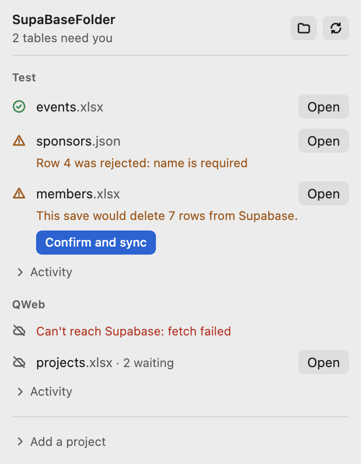
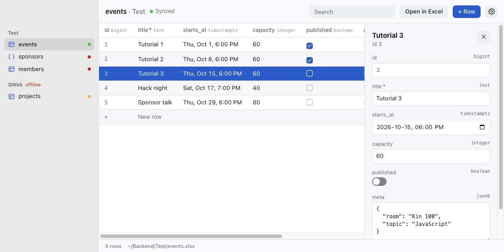

# SupaBaseFolder

[](https://github.com/zacfink/SupaBaseFolder/actions/workflows/tests.yml)

Your Supabase tables as plain files on your Mac.

SupaBaseFolder is a macOS menu bar app that turns each table in a Supabase project into a file in
`~/Backend/<project>/`, as either `.xlsx` or `.json`. Edit the file in Excel or VS Code, or let an AI
agent edit it, save, and the change reaches Supabase within seconds. When your site writes to Supabase,
the file updates live.



## What it does

- **Two-way live sync.** File saves push up, and Supabase changes come down through Realtime (or a
  30-second poll for tables that aren't in the Realtime publication).
- **Safe by default.** A save that deletes more than 5 rows, or removes a column, pauses until you
  confirm it in the menu. Every row that gets overwritten or deleted is logged and can be restored from
  the Activity list.
- **Plays nicely with Excel.** It waits while a workbook is open, so it never writes over your unsaved
  edits.
- **Its own table window.** View and edit a table without Excel. See [The table window](#the-table-window).
- **Offline-friendly.** Edits made offline queue up and sync on reconnect.
- **Agent-friendly.** Each project folder has a generated `_schema.md` describing every table,
  column and rule, so an AI agent can read it and edit the files correctly.
- **Keys stay in the Keychain.** Project keys are encrypted with macOS `safeStorage` and never written
  into `~/Backend`.

## The table window



Click **Open** next to a table in the menu bar window, or right-click the menu bar icon › **Open a table**.

- Cells show by type: checkboxes for booleans, readable dates, JSON as `key value` tags. Required
  columns are starred, and each header shows its Postgres type.
- Double-click a cell to edit it. Click a checkbox in the selected row to flip it. Pick a row to open the
  details panel, a form with a field for each column (dates, numbers, switches, a JSON editor), plus
  Duplicate and Delete.
- Add a row with **+ Row**, the "New row" line or ⌘N. It gets its `id` from Supabase when it syncs.
  Delete the selected row with ⌫ (it asks first). ⌘F searches, ↑/↓ move between rows.
- It writes the table's own file, so saves here sync exactly like saves from Excel, and they go through the
  same checks and the same delete guard. Bad values get the same errors, like
  `Row 3, capacity: "lots" is not a number`.
- If the workbook is open in Excel, the window goes read-only until you close it there.
- It follows the Mac's light or dark mode.

**Settings** (the gear in the window's toolbar):

| Setting | Options |
|---|---|
| Layout | Sidebar, with details when you pick a row (default) · Sidebar and table only · Table with details always shown, tables as tabs |
| The menu bar's Open button opens | This window (default) · Excel for `.xlsx`, VS Code for `.json` |

## Run it

```sh
npm install
npm start          # menu bar icon appears; click it, then "Add a project"
npm test
npm run package    # builds dist/SupaBaseFolder-darwin-arm64/SupaBaseFolder.app
npx electron scripts/screenshot.js   # regenerates the README screenshots
```

To add a project, you need its URL and a **secret** key (`sb_secret_…`), found in Supabase under
Project Settings → API Keys. The publishable key can't read the schema.

## Status

v1 works on macOS and is used against real projects. Up next is v2
([design](docs/superpowers/specs/2026-09-23-control-supabase-design.md)): creating tables from files, a
SQL inbox for agents, auth users, storage buckets, and new projects. Additive changes run straight away;
destructive ones wait for a human to approve them.

Built with Electron, supabase-js and SheetJS.
